# Generalized Analysis of Text Data

A comprehensive reference notebook demonstrating a wide range of NLP and text analysis techniques on the [20 Newsgroups](https://scikit-learn.org/stable/datasets/real_world.html#newsgroups-dataset) dataset. Designed as both a learning resource and a reusable template for new text analysis projects.

## Techniques Demonstrated

| Category | Details |
|---|---|
| **Data Wrangling** | 20 Newsgroups ingestion, Pandas dataset construction, text statistics |
| **Text Preprocessing** | Tokenisation, stopword removal (NLTK + extended list), lemmatisation |
| **Exploratory Analysis** | Word frequency distributions, category-level box plots |
| **Topic Modelling** | Latent Dirichlet Allocation (LDA) with scikit-learn |
| **Clustering** | K-Means on TF-IDF vectors, silhouette-based k selection, ARI/NMI evaluation against known labels, SVD visualisation |
| **Word Embeddings** | Word2Vec training, similarity queries, t-SNE projection |
| **Document Similarity** | Cosine similarity on TF-IDF representations |
| **NER** | spaCy named-entity recognition with entity-type frequency analysis |
| **Sentiment Analysis** | TextBlob polarity and NLTK VADER compound scores, category-level comparison |
| **Text Classification** | Multi-model comparison (Logistic Regression, Naive Bayes, Random Forest, Linear SVM) on TF-IDF features |
| **Summarisation** | Abstractive summarisation with DistilBART (Hugging Face Transformers) |
| **Dependency Parsing** | spaCy POS tagging and dependency visualisation |
| **Topic Coherence** | Gensim coherence scores for LDA evaluation |

## How to Use

1. Open the notebook in Google Colab via the badge above.
2. Run all cells (**Runtime → Run all**). No data upload is needed — the 20 Newsgroups dataset is fetched automatically.
3. To analyse your own text data, replace the `collect_data()` call with a function that returns a list of documents, category labels, and category names in the same format.

## Example Outputs

| | |
|---|---|
| 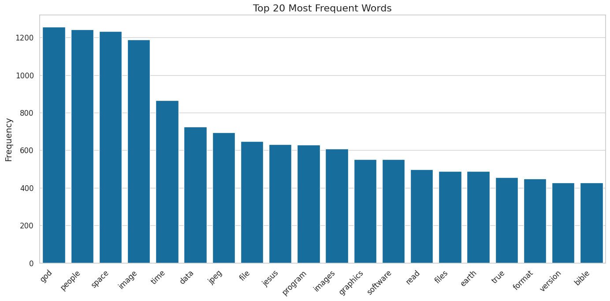 | 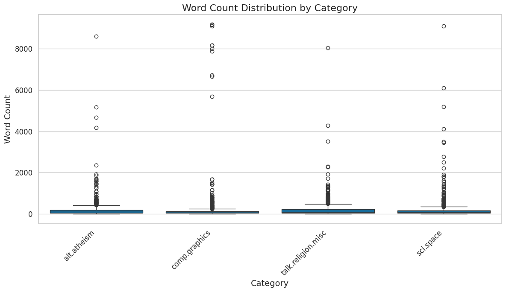 |
| 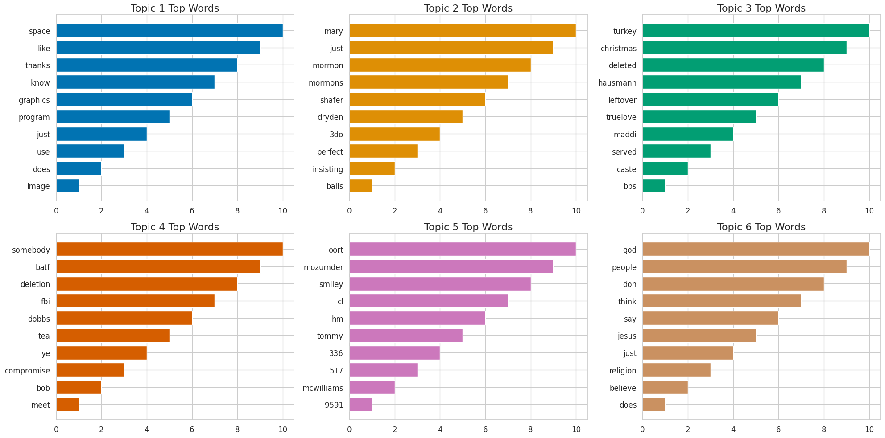 | 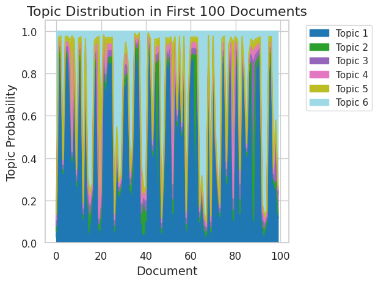 |
| 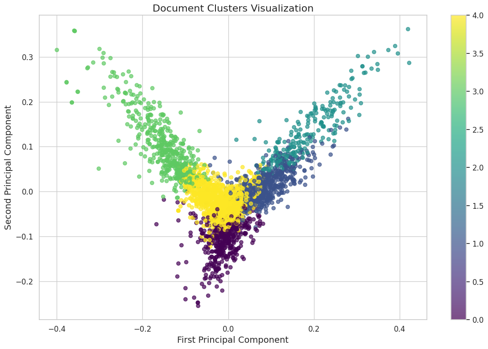 | 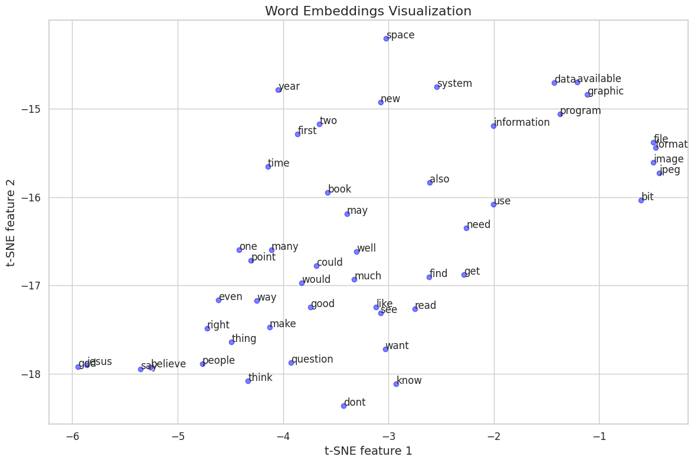 |
| 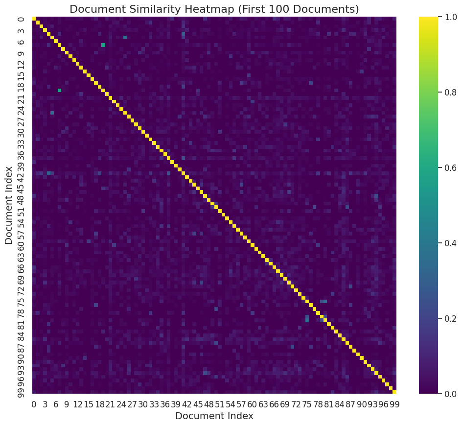 | 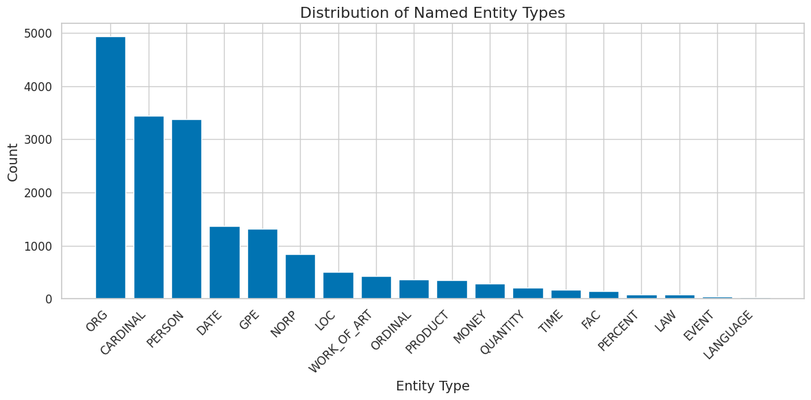 |
| 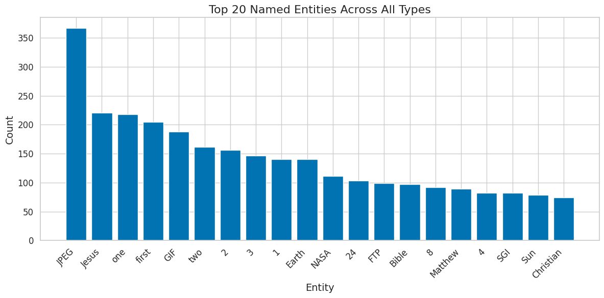 | 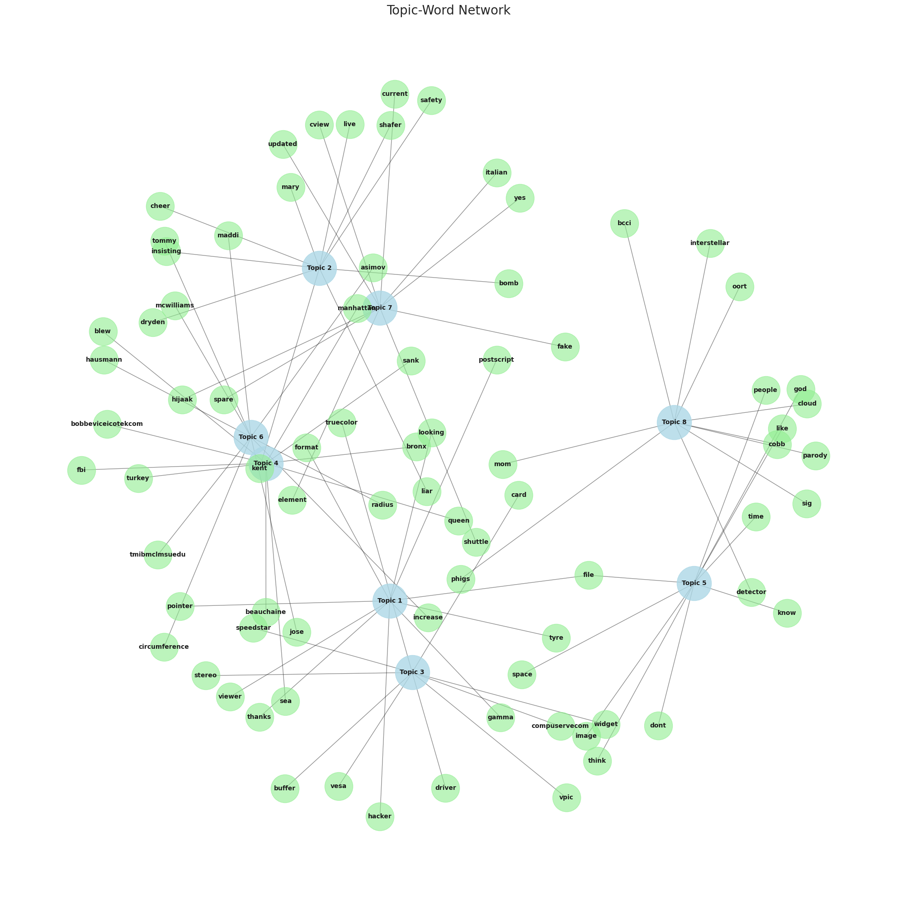 |
| 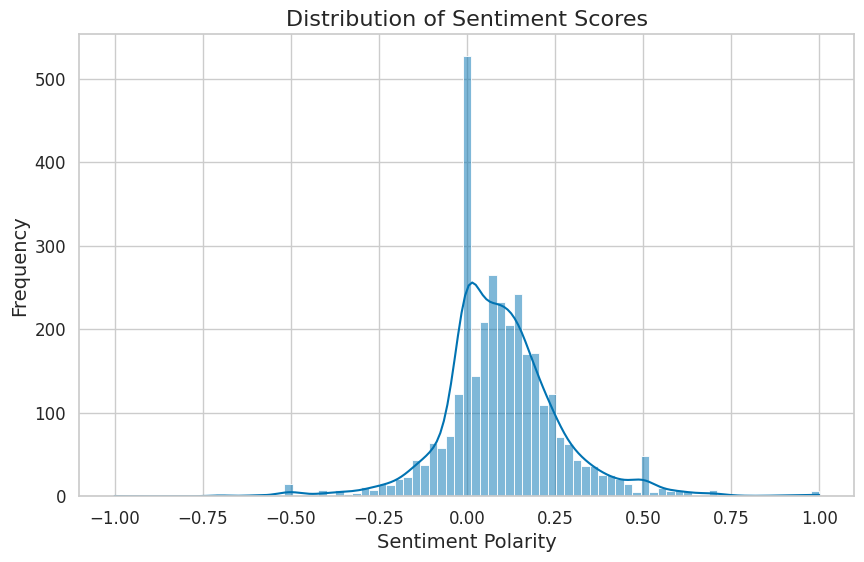 | 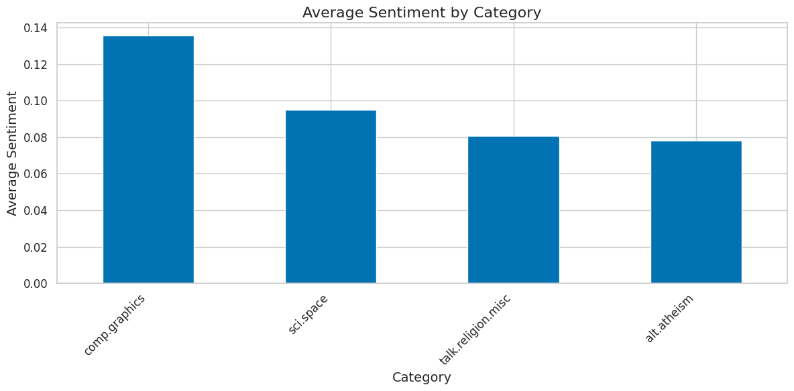 |
| 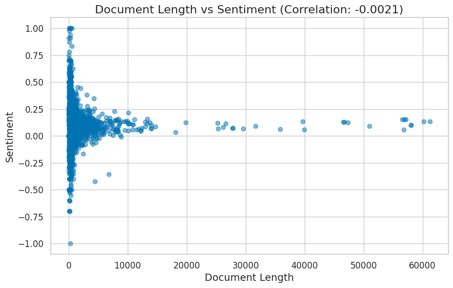 | |

## A Note on Generality

Every technique in this notebook is deliberately context-agnostic. The 20 Newsgroups dataset is used purely as a convenient, well-understood benchmark — swap it for customer reviews, research abstracts, social media posts, or any other corpus and the analysis pipeline applies unchanged. The real value is in the workflow: start broad with frequency analysis, narrow down with topic modelling and clustering, then layer on entity recognition, sentiment, and classification as the questions demand.

## License

This project is licensed under the [MIT License](LICENSE).

## Related

- [CNN X-ray Image Classifier](https://github.com/DrKenReid/CNN-Tutorial---X-ray-image-classifier) — deep learning for medical imaging
- [VAE for Molecule Discovery](https://github.com/DrKenReid/VAE-for-Molecule-Discovery) — generative modelling for drug discovery
- [kenreid.co.uk/data_science](https://www.kenreid.co.uk/data_science.html) — all projects, publications, and CV

## Author

**Ken Reid** — Data Scientist, photographer, and avid reader.

- [kenreid.co.uk](https://www.kenreid.co.uk) — Portfolio & blog
- [@kenreid.co.uk](https://bsky.app/profile/kenreid.co.uk) — Bluesky
- [@DrKenReid](https://github.com/DrKenReid) — GitHub
